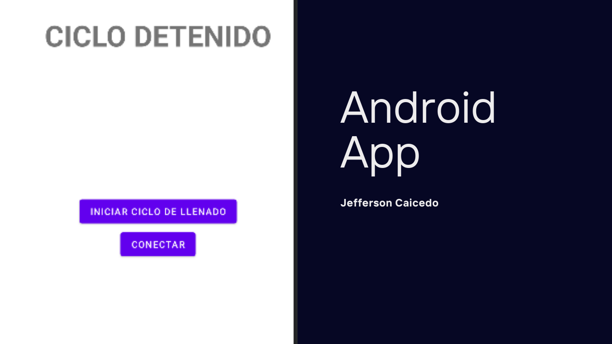

# Android App

 The project allows connecting from an android phone to a Raspberry Pi via bluetooth to send a value. With this value any automation process is started on the Raspberry.

<h3>Note:</h3>

Project made in Android Studio Android Studio Bumblebee | 2021.1.1 Patch 3

